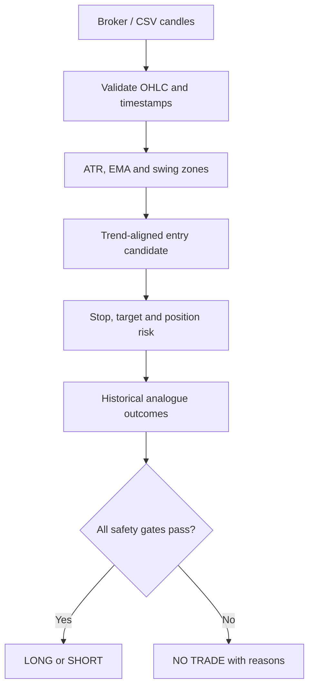

# Trade-U

Trade-U is a local, read-only Indian-market analysis workbench. Give it cash, futures, or option OHLC data and it will:

- mark nearby support and resistance from clustered swing points;
- classify EMA trend and price location;
- propose an entry, stop, target, projected profit %, and projected stop-loss %;
- show reward:risk and rupee risk/reward per lot;
- compare the current return shape with non-overlapping historical analogues;
- block a trade when its data, structure, spread, volume, expiry, position risk, sample size, or confidence is inadequate;
- read live/historical data from **Upstox** and **Dhan**, or run with CSV/demo data;
- model option-premium sensitivity under spot, time, and IV scenarios.

It does **not** place orders. A `NO TRADE` result is deliberate, not an error.

## Quick start on Windows

1. Install 64-bit Python 3.11 or 3.12.
2. Download/clone this repository.
3. Double-click `setup_windows.bat`.
4. Optionally put your read-only broker credentials in the generated `.env` file.
5. Double-click `run_windows.bat` and open `http://localhost:8501` if it does not open automatically.

Manual setup:

```powershell
py -3.12 -m venv .venv
.venv\Scripts\activate
python -m pip install -r requirements.txt
copy .env.example .env
python -m streamlit run app.py
```

Start with **Demo** mode. It proves the entire chart/analysis/UI path without an account or token.

## Broker inputs

### Upstox

Set `UPSTOX_ACCESS_TOKEN` in `.env` or paste it into the password field. Enter the exact Upstox instrument key, for example:

- `NSE_INDEX|Nifty 50`
- `NSE_EQ|INE002A01018`

Trade-U uses the V3 historical-candle endpoint, V2 full-quote endpoint, and the official `MarketDataStreamerV3` WebSocket client. Tokens, API entitlements, exchange hours, and broker subscription limits still apply.

### Dhan

Set `DHAN_CLIENT_ID` and `DHAN_ACCESS_TOKEN`. Enter the numeric Dhan security ID plus its segment and instrument code. Examples include `IDX_I` + `INDEX`, `NSE_EQ` + `EQUITY`, and `NSE_FNO` + `FUTIDX`/`OPTIDX`.

Trade-U uses the official DhanHQ SDK for intraday/daily candles, full quote, option chain hooks, and MarketFeed V2. Dhan intraday history has broker-defined date-window limits; use a smaller window if the API rejects a request.

See [Broker setup and data contracts](docs/BROKERS.md) for exact fields and troubleshooting.

## How a decision is produced



The historical analogue estimator normalizes the last return sequence, finds the closest older sequences, then checks whether the equivalent target or stop was touched first over a fixed forward horizon. Same-bar ambiguity is counted as a stop. The app displays the raw sample size and a Wilson confidence interval; it does not turn a small backtest into certainty.

Every gate must pass before a directional verdict appears:

| Gate | Default policy |
|---|---|
| Clean history | At least 150 candles and 90% valid rows |
| Levels | Both nearby support and resistance exist |
| Location | Price is within 1.2 ATR of the trend-aligned level |
| Geometry | Stop and target are on the correct sides of entry |
| Reward:risk | At least 1.30R |
| Spread | At most 0.50% when a live quote exposes bid/ask |
| Volume | Latest bar at least 15% of its 20-bar median |
| Expiry | More than one calendar day remains |
| Position risk | One lot fits the configured rupee risk budget |
| Analogue sample | At least 20 historical matches |
| Confidence | 95% Wilson lower bound beats break-even by 2 percentage points |

The sidebar exposes the thresholds that are reasonable to tune. See [Architecture](docs/ARCHITECTURE.md) for implementation details.

## CSV format

Required columns (case-insensitive):

```csv
timestamp,open,high,low,close,volume,oi
2026-09-15T09:15:00+05:30,22410,22440,22395,22425,521300,8142500
```

`date`, `datetime`, or `time` can substitute for `timestamp`; `vol` and `open_interest` are recognized aliases.

## Evidence and open-source foundations

Technical patterns are hypotheses, not laws. Trade-U therefore emphasizes out-of-sample-like analogues, transaction costs, confidence bounds, and an explicit no-trade state.

- Lo, Mamaysky & Wang, *Foundations of Technical Analysis* (2000), studies automated pattern recognition rather than discretionary pattern naming: [Journal of Finance / DOI](https://doi.org/10.1111/0022-1082.00265).
- Sullivan, Timmermann & White, *Data-Snooping, Technical Trading Rule Performance, and the Bootstrap* (1999), explains why searching many rules inflates apparent performance: [Journal of Finance / DOI](https://doi.org/10.1111/0022-1082.00163).
- Bajgrowicz & Scaillet, *Technical Trading Revisited* (2012), highlights false discoveries and transaction costs: [Journal of Financial Econometrics / DOI](https://doi.org/10.1093/jjfinec/nbr020).
- López de Prado, *Advances in Financial Machine Learning*, motivates leakage-aware validation and realistic backtesting: [publisher page](https://www.wiley.com/en-us/Advances+in+Financial+Machine+Learning-p-9781119482086).
- [vectorbt](https://github.com/polakowo/vectorbt), [backtesting.py](https://github.com/kernc/backtesting.py), and [TA-Lib](https://github.com/TA-Lib/ta-lib-python) are useful audited/open-source references for future batch research. Trade-U's MVP keeps its core math small and inspectable instead of hiding the decision behind one of these libraries.

Official broker references used by the adapters:

- [Upstox API overview](https://upstox.com/developer/api-documentation/api-overview/), [instrument files](https://upstox.com/developer/api-documentation/instruments/), [V3 market feed](https://upstox.com/developer/api-documentation/v3/get-market-data-feed/), and [official Python SDK](https://github.com/upstox/upstox-python).
- [Dhan historical data](https://dhanhq.co/docs/v2/historical-data/), [market quotes](https://dhanhq.co/docs/v2/market-quote/), [live feed](https://dhanhq.co/docs/v2/live-market-feed/), [option chain](https://dhanhq.co/docs/v2/option-chain/), and [official Python SDK](https://github.com/dhan-oss/DhanHQ-py).

## Tests

```powershell
python -m pip install -r requirements-dev.txt
python -m pytest
python -m ruff check .
```

The tests do not require broker credentials or make live network calls.

## Important limitations

- Stops can gap and fill worse than the displayed price.
- OHLC bars cannot reveal intrabar path; same-bar stop/target collisions are treated pessimistically.
- Options add volatility, theta, exercise style, liquidity, and model risk. BSM scenarios are not premium forecasts.
- A broker quote can be delayed or stale. A missing bid/ask is reported but cannot be spread-filtered.
- Futures and option lot sizes, expiries, and security IDs change; verify them against the broker's current instrument master.
- Taxes, brokerage, statutory fees, and slippage vary. The cost input is an estimate.
- Historical similarity does not imply causal or persistent edge.

Use this software for research and education. You remain responsible for every trading decision.

